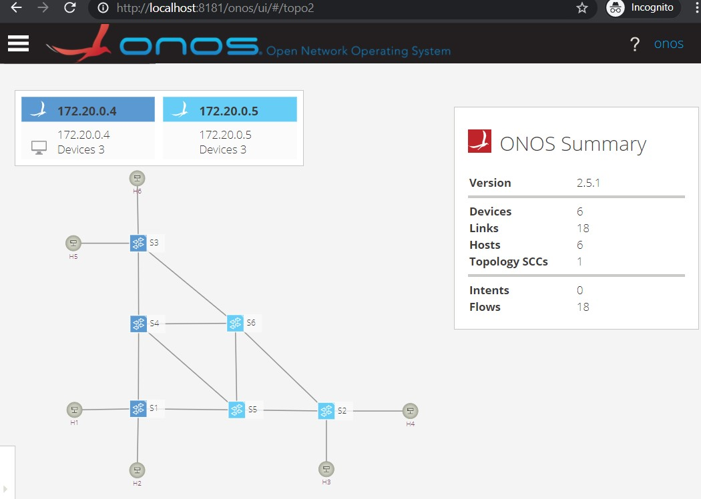

# ONOS_autocluster
This script is intended to automatically deploy an ONOS cluster, a fork from original work by ederollora/ONOS_autocluster

## Prerequisite (you may skip it if already installed)
- Docker engine installed on your Ubuntu server with a non-user privileges to access all docker commands, use this [link](https://docs.docker.com/engine/install/ubuntu/#install-using-the-convenience-script)
- [Mininet](http://mininet.org/download/#option-3-installation./-from-packages) 
- `sudo apt install jq python-is-python2`

## Steps to do
- Run `git clone https://github.com/yunanalamsyah15/ONOS_autocluster_Yunan.git`
> You may encounter problem when running the script if jq and python2 is not install on your server
> Just install the dependencies `sudo apt install jq python-is-python2`
- Go the directory `cd ONOS_autocluster`
- Create ONOS cluster (by default 2 instances) `./create_cluster.sh`
- Set sshkey and env parameters `./set_env_sshkey.sh`

## Testing (with an example mytopo.py)
> mytopo.py consists of 6 switches and 6 hosts
- Go to directory `cd ONOS_autocluster`
- Run the onos-netfcg `onos-netcfg $OC1 mytopo.json`
> setting the label name of the switches and hosts in ONOS
- Run the example `sudo python3 mytopo.py $ONOS_INSTANCES`
- In the mininet shell `pingall` or `h1 ping h5`
> run the topology and connected all switches to the two ONOS Instances
> in the pingall and ping command does not can activate apps in ONOS or do some steps with host-to-host intent from ONOS GUI
- On the other terminal, run `onos`
> it will direct you to ONOS CLI, you can just press TAB to see other command completion
- You may activate the necessary ONOS app, `app activate fwd` or 
- checking paths between two switches `paths --disjoint of:0000000000000001 of:0000000000000003`
- Go to ONOS GUI with your web browser to open http://[your_ip_address or localhost]:8181/onos/ui

